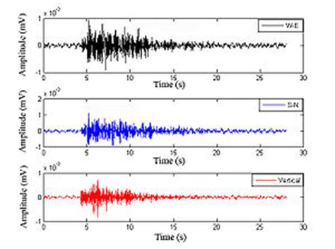

# Actividades a realizar

===============

1. ***Objetivo***: aplicar el concepto de método para resolver un problema y construir un programa en lenguaje Java, llamado Taller01Sismos.java.

2. ***Caso a solucionar***: simulación y análisis sismográfico de datos.

Se requiere por parte de la ONEMI una simulación para análisis de datos sísmicos.

Se quiere simular el funcionamiento de un sensor sismológico instalado en en la ciudad de Temuco, que almacena 10 lecturas diarias, durante una semana.